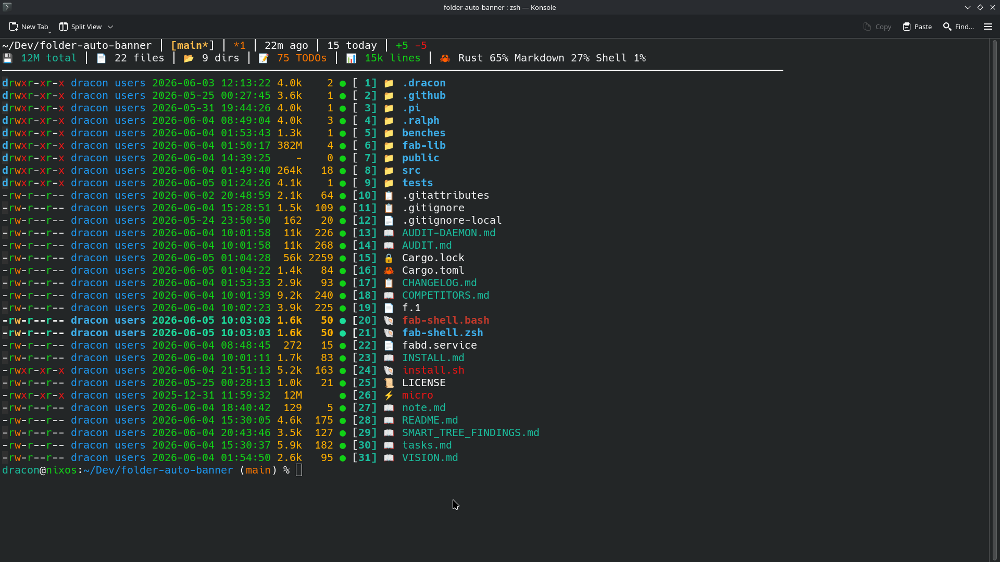

# f — Folder Auto Banner

<p align="center">
  
</p>

A contextual directory dashboard that combines a file listing with project signals such as git status, TODOs, code metrics, build status, ports, Docker state, and cached directory sizes.

Repeated views are served from the background daemon. The first cold view of a very large directory returns quickly and may show temporary `4.0k` placeholders while directory sizes refresh in the background; subsequent warm views use populated cached sizes.

## What It Does

When you run `f`, you see:
- File listing (like `ls`/`exa`/`lsd`)
- Git status, last commit, commits today, branches
- Build status with duration
- TODO count
- Languages breakdown
- Ports in use
- Docker status
- Cached test results

**Fast context without extra commands.**

## vs lsd / eza

fab is **not a drop-in `ls` replacement** — it's a **contextual directory dashboard**. While lsd and eza focus on making `ls` pretty, f adds **project context** (git, TODOs, ports, docker, build status, code metrics) and **daemon caching** for instant repeated access.

| Feature | f | lsd | eza |
|---------|-----|-----|-----|
| Pretty listing | ✅ | ✅ | ✅ |
| Icons | ✅ | ✅ | ✅ |
| Tree view | ✅ | ✅ | ✅ |
| **Git status** | ✅ (rich) | ✅ | ✅ |
| **Context banner** | ✅ | ❌ | ❌ |
| **Daemon caching** | ✅ | ❌ | ❌ |
| **TODO count** | ✅ | ❌ | ❌ |
| **Port detection** | ✅ | ❌ | ❌ |
| **Build status** | ✅ | ❌ | ❌ |
| **Language breakdown** | ✅ | ❌ | ❌ |
| Long format (`-l`) | ✅ (default) | ✅ | ✅ |
| Recursive (`-R`) | ✅ | ✅ | ✅ |

See [COMPETITORS.md](COMPETITORS.md) for the full comparison.

## Quick Start

```bash
# Build + install everything (binary, shell function, daemon, auto-banner hook)
./install.sh
exec zsh   # or: source ~/.bashrc
```

This sets up:
- The `f` binary in `~/.local/bin/`
- The shell function (enables `f N` → `cd` navigation)
- The auto-banner hook (shows a banner on every `cd`)
- The background daemon

If you only need the shell function (e.g., after a manual build):

```bash
f install
exec zsh   # or: source ~/.bashrc
```

## Usage

```bash
f                    # Directory listing + context
f <dir>              # Listing for specific dir
f -S                 # Sort by size
f -t                 # Sort by time
f -X                 # Sort by extension
f -G                 # Sort by git status
f --versionsort      # Natural sort (file1, file2, file10)
f -a                 # Show dotfiles
f --tree             # Tree view
f --json             # JSON output
f -R, --recursive    # Recurse into subdirectories
f --filter rs        # Filter by pattern
f install            # Install shell function for f N → cd
f config             # Open config file
f daemon restart   # Restart daemon
f daemon status    # Check daemon status
f daemon stop      # Stop daemon
f install          # Install shell function for f N → cd
f config           # Open config file
```

## Shell Function (`f install`)

The `f install` subcommand writes shell wrappers that enable `f N` → `cd` navigation:

- Writes `~/.local/bin/fab-shell.zsh` and `~/.local/bin/fab-shell.bash`
- Adds source lines to `~/.zshrc` and/or `~/.bashrc`
- Is idempotent — safe to run multiple times

This is called automatically by `./install.sh`. You can also run it standalone:

```bash
f install              # Install shell wrappers
f install --debug      # Install with debug output
```

Start a new shell, or activate the wrappers immediately:

```bash
source ~/.local/bin/fab-shell.zsh   # for zsh
source ~/.local/bin/fab-shell.bash  # for bash
```

The shell wrapper is the source of truth for `f N` navigation. It calls the installed `f` binary; the checked-in `fab-shell.zsh` and `fab-shell.bash` files are generated from the compiled-in `src/shell_wrapper.rs` constants.

## Numbered Navigation

When `numbered = true` in config (or enabled by default), each item gets a number:

```
[ 1] 📁 .github
[ 2] 📁 src
[ 3] 📄 README.md
```

Navigate with `f N`:

```bash
f 2          # cd into item 2 (if directory)
f 3          # open item 3 in editor (if file)
f 3 cat      # open item 3 with `cat`
f 3 krita    # open item 3 with krita
f 3 -e       # force open in editor
f 3 -x       # force run the file directly
```

> **Note:** `f N` requires the shell wrappers installed by `./install.sh` or `f install`. To activate them in your current terminal without restarting your shell:
>
> ```bash
> source ~/.local/bin/fab-shell.zsh   # for zsh
> source ~/.local/bin/fab-shell.bash  # for bash
> ```

## CLI Flags (Actions)

### Sorting
| Flag | Description |
|------|-------------|
| `--sort name\|size\|date\|type\|git\|extension\|version` | Sort by field |
| `-t`, `--timesort` | Sort by time modified |
| `-S`, `--sizesort` | Sort by size |
| `-X`, `--extensionsort` | Sort by extension |
| `-G`, `--gitsort` | Sort by git status |
| `--versionsort` | Natural sort (version numbers) |
| `--no-sort` | No sort, directory order |
| `--reverse` | Reverse sort |
| `--group-dirs first\|last` | Group directories |

### Display
| Flag | Description |
|------|-------------|
| `-a`, `--hidden` | Show dotfiles |
| `--tree [depth]` | Tree view (0 = unlimited) |
| `--group` | Group by type (dirs, files, symlinks) |
| `--filter <pattern>` | Filter by name |
| `--max <N>` | Limit items |
| `--compact` | Less info |
| `-R`, `--recursive` | Recurse into subdirectories |
| `--verbose` | More info |

### Output
| Flag | Description |
|------|-------------|
| `--json` | JSON output |
| `--raw` | Plain text output |

## Config File

Location: `~/.config/fab/config.toml`

Open with: `f config`

### Display Settings
```toml
[display]
permission = "rwx"        # rwx, octal, disable
size = "default"          # default, short, bytes
date = "date"             # date, relative
classify = true           # append */=>@|
no_symlink = false
total_size = true
```

### Column Selection
```toml
[columns]
show = ["permission", "owner", "group", "size", "date", "name"]
hide = ["inode", "links"]
```

### Feature Toggles
```toml
[features]
git_status = true
build_status = true
todo_count = true
languages = true
ports = true
docker = true
```

### Navigation
```toml
[features]
numbered = true          # Show item numbers for f N navigation
open_command = "micro"   # Default editor for f N (overridden by $EDITOR)
```

### Sorting
```toml
[sort]
default = "name"
reverse = false
group_dirs = "first"
```

### Recency Gradient
```toml
[display]
# Color rows based on recency: same hues, dimmer for older files
# Bright new, dim old — at-a-glance scan of what changed recently
color_scale = "all"          # "all", "age", "size", or "" to disable
color_scale_mode = "gradient" # "gradient" (default) or "fixed"
```

Tiers: <1h = bold, <1d = normal, <1w = faded gray, <1m = dim, >1m = very dim.
Recent files pop out; old files recede into the background.

## Environment Variables

| Variable | Description |
|----------|-------------|
| `FAB_NO_TODOS` | Set to `1` to disable TODO scanning |
| `FAB_NO_PORTS` | Set to `1` to disable port detection |
| `FAB_NO_DOCKER` | Set to `1` to disable Docker detection |
| `FAB_NO_METRICS` | Set to `1` to disable code metrics |
| `NO_COLOR` | Disable colors (per spec) |
| `EDITOR` | Editor for `f config` (default: vi) |

## Testing

```bash
cargo test    # full test suite
cargo clippy --all-targets --all-features -- -D warnings
```

## License

MIT
